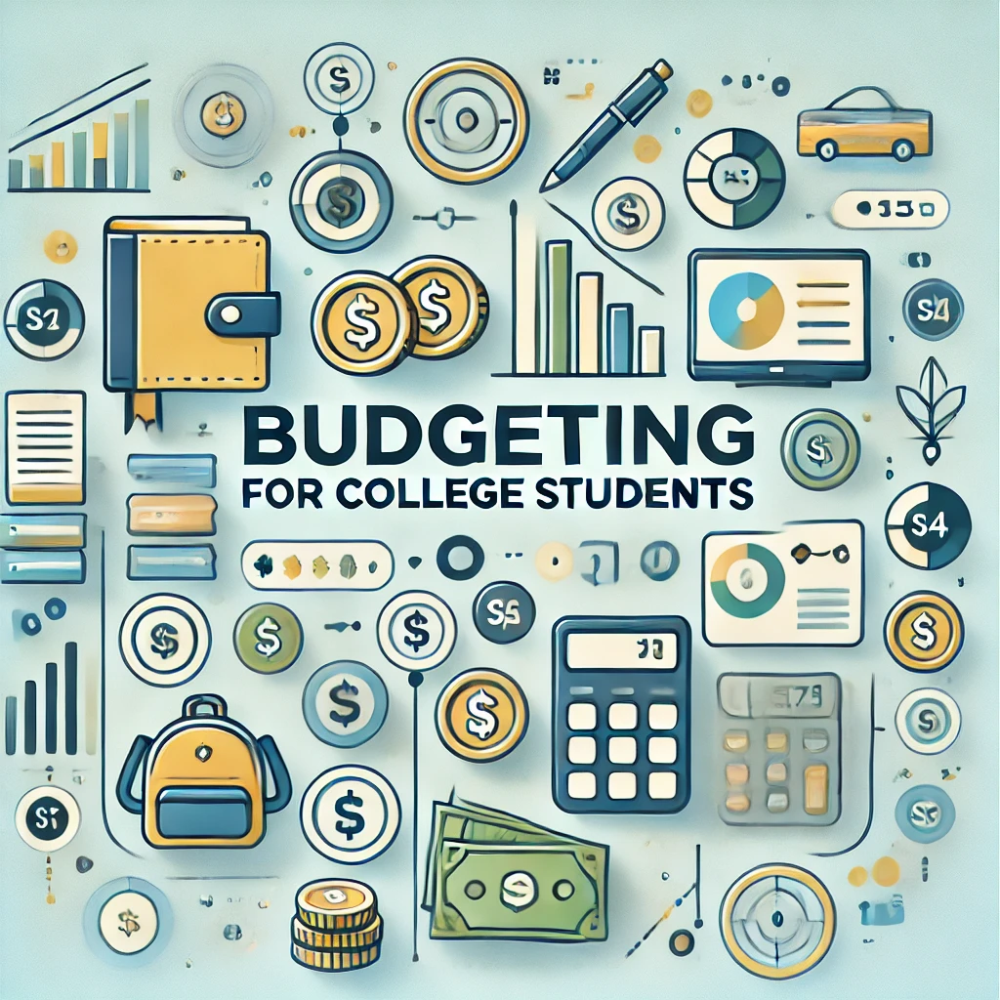

# Budgeting for College Students

## Members: 
Jihan Lee and Briana Yang

## Description: 
This data analysis project aims to explore and optimize budgeting strategies for college students by analyzing various financial factors that impact their spending and savings.

## Objective
The primary objective of this project is to build a user-friendly budgeting tool tailored to the unique financial needs of college students. The tool will help students track income, manage expenses, set savings goals, and visualize their spending patterns. By providing insights into their financial habits, the project aims to empower students to make informed decisions about their money and develop strong financial management skills during their academic years. 

## Planned Workflow
1. **Planning & Requirements Gathering**
* Define the scope of the budgeting tool, including necessary features such as expense tracking, income management, and reporting.
* Identify key financial challenges faced by college students and the most important budgeting categories (e.g., food, housing, tuition, entertainment).

2. **Data Collection & Research**
* Gather sample data on typical college student expenses and income sources.
* Research financial literacy needs for students to ensure the tool provides educational value.

3. **Backend Development**
* Set up a server and database to store user financial data securely.
* Implement backend logic to handle expense entry, income tracking, and savings calculations.

4. **Frontend Development**
* Design a user interface (UI) with a clean, intuitive dashboard that allows students to input expenses, income, and set budget goals.
* Include data visualizations (e.g., bar charts, pie charts) to show students their spending breakdown and progress toward savings goals.

5. **Financial Algorithms**
* Develop algorithms to analyze spending habits and provide actionable insights, such as reminders for upcoming payments, suggestions for cutting costs, and automated savings recommendations.

6. **Testing**
* Test the app with mock user data to ensure calculations are accurate and all features are working correctly.
* Perform user experience (UX) testing with real college students to gather feedback on ease of use and feature usefulness.

7. **Deployment**
* Deploy the tool as a web or mobile application, making it accessible to college students across different devices.

8. **Post-Launch Improvements**
* Continuously gather feedback from users to refine features and address any bugs or usability issues.
* Expand the tool to include features like investment tracking or integrating with banking APIs for real-time updates.

## Contributions
- **Jihan**: Writing Objective, Planned Workflow section in README file.
- **Briana**: Project title, member names, and description.

## Contact
If you have any questions, feel free to reach out [here](https://economics.emory.edu)!
